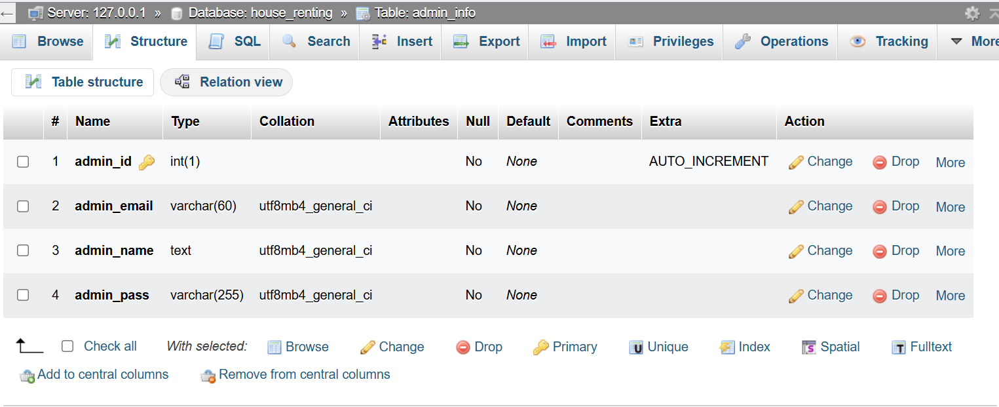
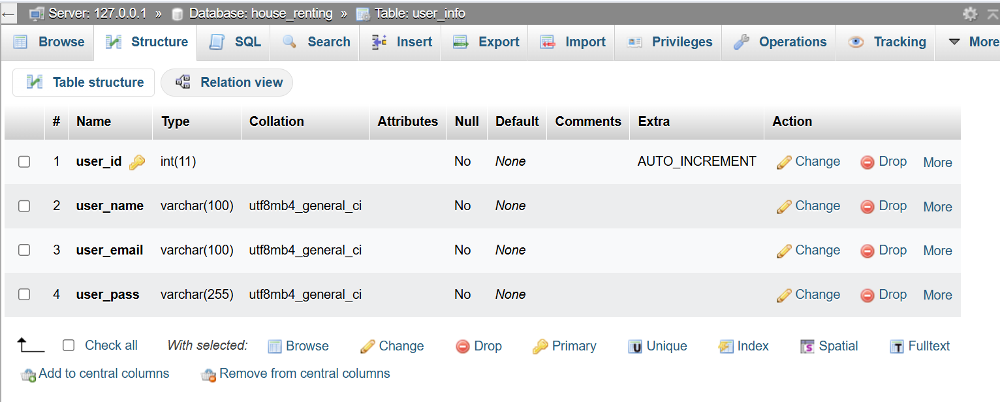
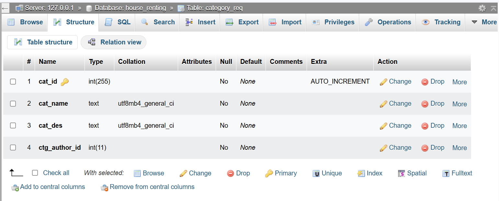
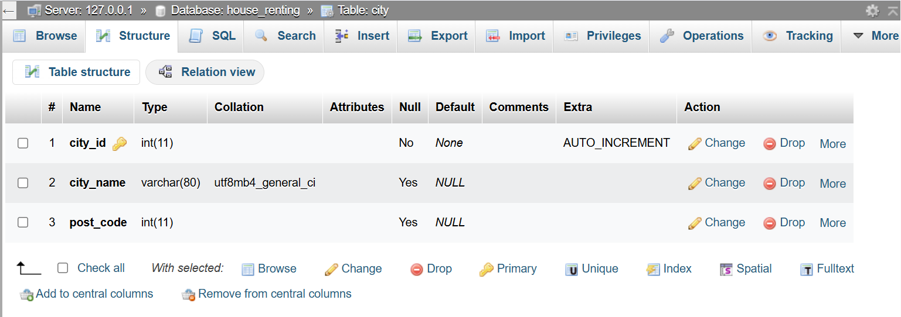
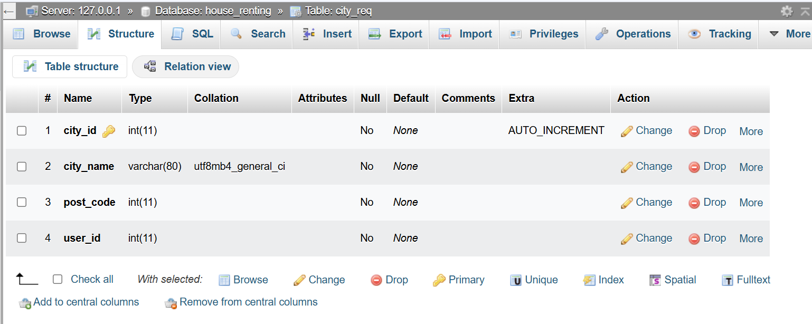
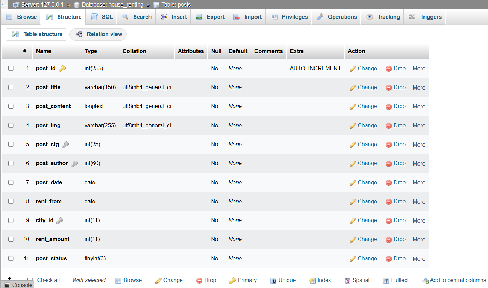
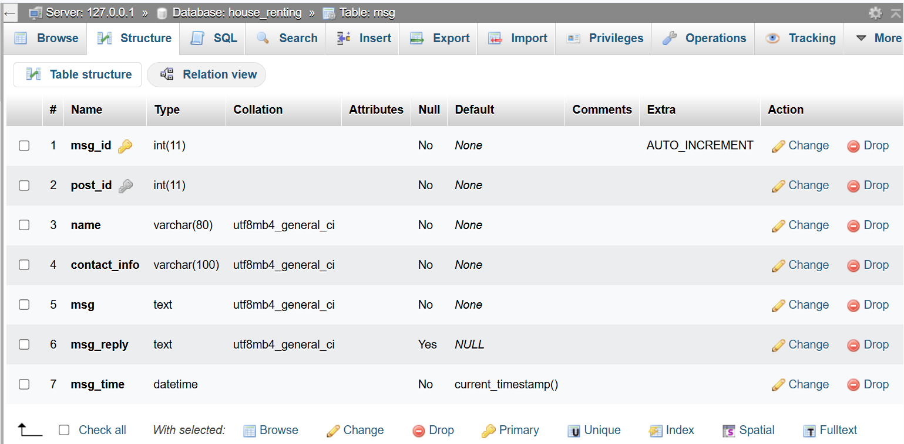
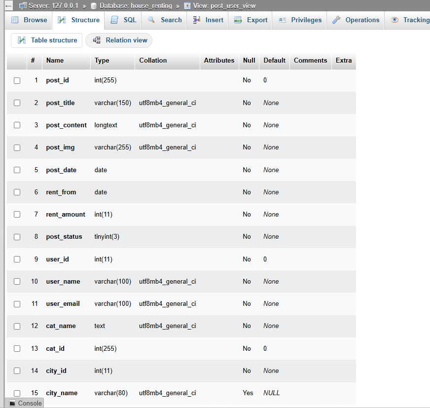
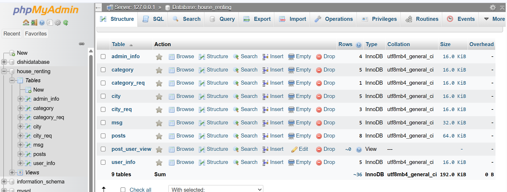

Here's a **professionally formatted `README.md`** for your House Renting Website project:

---

# 🏠 House Renting Website

A web application for renting houses, built using PHP, MySQLi, HTML, CSS, and Bootstrap 5.

---

## 🚀 Technologies Used

- **Frontend:** HTML, CSS, Bootstrap 5
- **Backend:** PHP (with PDO for secure prepared statements)
- **Database:** MySQL (using phpMyAdmin with XAMPP)
- **Security:**

  - Passwords are stored using **MD5 hashing**
  - **Session management** for authentication
  - **Prepared statements (PDO)** to prevent SQL injection

---

## 🔐 Authentication & Roles

- **Sign Up:** Users must request account creation from the admin.
- **Login:** Both users and admins can log in using email and password.
- **Admin Privileges:**

  - Add/Edit/Delete/Approve: Posts, Cities, Categories
  - View and delete user posts and messages

- **User Privileges:**

  - Create/Edit/Delete/Hide their own posts
  - Comment on posts

- **Public Features:**

  - Browse and filter public posts by **date, rent amount, city**, and other criteria

---

## 👨‍💻 Developer

**Tanvir Anjom Siddique**
Department of CSE, RUET
Batch: CSE_19_A

---

## 📺 [Video of Live Website](https://youtu.be/WOR251usq0c)

[](https://youtu.be/WOR251usq0c)

Click the thumbnail above to watch a walkthrough of the live website on YouTube.

## 📁 Project Structure

```
HouseRentingWebsite_with_PDO/
├── Admin/
│   ├── account_setting.php
│   ├── add_category.php
│   ├── add_city.php
│   ├── add_post.php
│   ├── dashboard.php
│   ├── ...
│   └── assets/
│       └── img/
│   └── class/
│       ├── function.php
│       └── function_without_prepareStatement.php
├── assets/
│   ├── css/
│   ├── fonts/
│   ├── images/
│   └── js/
├── img_project/          # Screenshots of project
├── includes/             # Modular PHP Components
├── upload/               # Uploaded images
├── vendor/               # Bootstrap and jQuery libraries
├── filter.php
├── house_renting.sql     # Database dump
├── index.php
├── README.md
├── setup_project.txt
```

---

## ⚙️ Setup Instructions

1. **Clone or Copy the Project:**

   - Place it in `xampp/htdocs/` (or use VSCode PHP Server).

2. **Setup Database:**

   - Start Apache and MySQL from XAMPP.
   - Go to phpMyAdmin and create a database named: `house_renting`
   - Import `house_renting.sql` into the database.

3. **Run the Project:**

   - Open `index.php` from VSCode → Right-click → **PHP Server: Serve Project**
     → Project runs at `http://localhost:3000/index.php`
   - Or manually open in browser at: `http://localhost/HouseRentingWebsite_with_PDO/`

---

## 🔑 Admin Credentials

| Email                                       | Password |
| ------------------------------------------- | -------- |
| [admin@gmail.com](mailto:admin@gmail.com)   | 123      |
| [adm@gmail.com](mailto:adm@gmail.com)       | 123      |
| [tanvir@gmail.com](mailto:tanvir@gmail.com) | 123      |
| [abc@gmail.com](mailto:abc@gmail.com)       | 123      |

## 🔑 User Credentials

| Email                                   | Password |
| --------------------------------------- | -------- |
| [alvi@gmail.com](mailto:alvi@gmail.com) | 123      |

> **Note:** Passwords are stored as `md5('123')` in the `admin_info` table.

---

## 🗃️ Database Tables

**Main Tables:**

- `admin_info` — Admin account details
- `user_info` — Registered users
- `category` — Categories for post types
- `city` — Cities where posts are located
- `posts` — Post details
- `msg` — Comments/messages
- `category_request`, `city_request` — User-submitted suggestions

**Database View:**

- `post_user_view`: Combines post, user, admin, and category details for rich data display

---

## 🖼️ Screenshots (Located in `img_project/`)

| Screenshot                          | Description                                                                                                 |
| ----------------------------------- | ----------------------------------------------------------------------------------------------------------- |
|      | **Admin Table** – Shows admin credentials and data used for authentication and management.                  |
|       | **User Table** – Stores registered users, including hashed passwords and user metadata.                     |
|        | **Categories** – Lists rental categories (e.g., Flat, Sublet) created by admin or users.                    |
|    | **Category Requests** – User-submitted category suggestions pending admin approval.                         |
|            | **City Table** – Contains available cities for house listings.                                              |
|        | **City Requests** – New city suggestions submitted by users awaiting approval.                              |
|           | **Posts Table** – Core table containing house listing details such as title, rent, image, etc.              |
|             | **Messages / Comments** – Users can comment on listings, handled through this table.                        |
|  | **Post User View** – SQL `VIEW` joining posts, users, categories, and cities for easier frontend rendering. |
|      | **ERD / Full Table View** – Snapshot of the full relational database schema and relationships.              |

## 🛠 Troubleshooting

### ❌ SQL Import Error:

> `#1833 - Cannot change column 'cat_id': used in a foreign key constraint 'posts_ibfk_2'`

**Solution:**

- Before import, run:

```sql
ALTER TABLE `category` CHANGE `cat_id` `cat_id` INT(255) NOT NULL AUTO_INCREMENT;
```

- Uncheck: **Enable foreign key checks** during import.

### 🔧 Post-import Errors:

1. **Cannot modify rows:**

   - Ensure each table has a valid **Primary Key (PK)** and set to **Auto Increment (AI)**

   | Table      | Primary Key |
   | ---------- | ----------- |
   | posts      | post_id     |
   | user_info  | user_id     |
   | admin_info | admin_id    |
   | category   | cat_id      |
   | city       | city_id     |

2. **Issue accessing `post_user_view`:**

   - Delete and recreate the view:

```sql
DROP VIEW IF EXISTS post_user_view;
CREATE VIEW post_user_view AS
SELECT post_id, post_title, post_content, post_img, post_date, rent_from, rent_amount, post_status,
       user_id, user_name, user_email, cat_name, cat_id, posts.city_id, city_name
FROM posts
JOIN user_info ON posts.post_author = user_info.user_id
JOIN category ON posts.post_ctg = category.cat_id
JOIN city ON posts.city_id = city.city_id;
```

---

Made with ❤️ by **Tanvir Anjom Siddique** | RUET CSE'19A
🔗 [Portfolio](https://tanvirsweb.github.io) | [GitHub](https://github.com/tanvirsweb)

---
